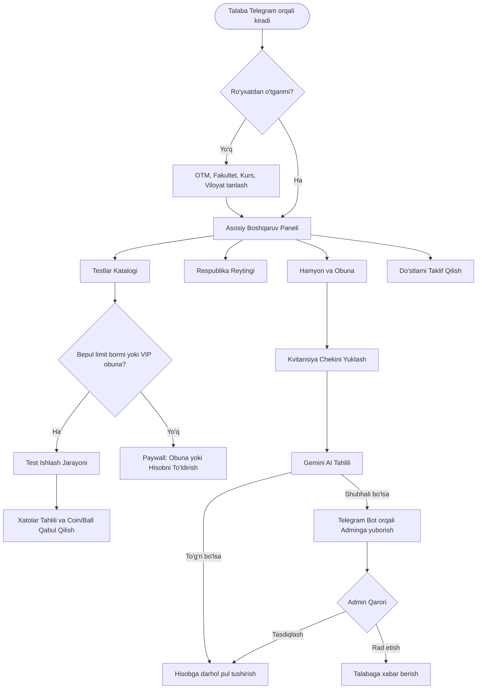
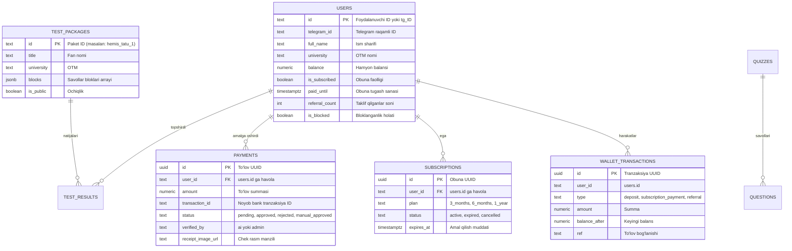

# 📘 YuksalQuiz — Loyiha Tasnifi, Funksional Ishlash Mexanizmi va Ma'lumotlar Bazasi Arxitekturasi

> **Hujjat versiyasi:** 1.0.0 (Rasmiy texnik hujjat)  
> **Loyiha nomi:** YuksalQuiz (Talabalar uchun aqlli test va HEMIS imtihonlariga tayyorlanish platformasi)  
> **Platforma:** Telegram Mini App (TMA), Web PWA  
> **Ishlab chiquvchi ekotizim:** React 19 + TypeScript + Vite + Tailwind CSS + Zustand + Supabase (PostgreSQL) + Google Gemini AI + Telegram Bot API + Vercel Serverless  

---

## 📑 Mundarija
1. [Loyiha Tasnifi va Maqsadi](#1-loyiha-tasnifi-va-maqsadi)
2. [Foydalanuvchi Rollari va Ishlash Funksiyalari](#2-foydalanuvchi-rollari-va-ishlash-funksiyalari)
   * 2.1. [Onboarding va Ro'yxatdan o'tish](#21-onboarding-va-royxatdan-otish)
   * 2.2. [Test Tizimi va Mashq Mexanizmi](#22-test-tizimi-va-mashq-mexanizmi)
   * 2.3. [Gamifikatsiya, Coinlar va Kunlik Bonus (Daily Streak)](#23-gamifikatsiya-coinlar-va-kunlik-bonus-daily-streak)
   * 2.4. [Respublika va OTM Reytingi (Leaderboard)](#24-respublika-va-otm-reytingi-leaderboard)
   * 2.5. [Referal Dasturi (Do'stlarni taklif qilish)](#25-referal-dasturi-dostlarni-taklif-qilish)
   * 2.6. [Monetizatsiya va Paywall Siyosati](#26-monetizatsiya-va-paywall-siyosati)
   * 2.7. [P2P To'lov va Gemini AI Kvitansiya Nazorati](#27-p2p-tolov-va-gemini-ai-kvitansiya-nazorati)
   * 2.8. [Telegram Bot (@YuksalQuiz_bot) Integratsiyasi](#28-telegram-bot-yuksalquiz_bot-integratsiyasi)
   * 2.9. [Admin Boshqaruv Paneli](#29-admin-boshqaruv-paneli)
3. [SQL Ma'lumotlar Bazasi (Supabase PostgreSQL) Arxitekturasi](#3-sql-malumotlar-bazasi-supabase-postgresql-arxitekturasi)
   * 3.1. [Jadvallar Sxemasi (Schema)](#31-jadvallar-sxemasi-schema)
   * 3.2. [Tranzaksiyaviy SQL Funksiyalar (Stored Procedures)](#32-tranzaksiyaviy-sql-funksiyalar-stored-procedures)
   * 3.3. [Xavfsizlik (RLS - Row Level Security) Qoidalari](#33-xavfsizlik-rls---row-level-security-qoidalari)
   * 3.4. [Indekslar va Kesh Optimallashtirish](#34-indekslar-va-kesh-optimallashtirish)
   * 3.5. [Supabase Storage (Kvitansiyalar ombori)](#35-supabase-storage-kvitansiyalar-ombori)
4. [Dasturiy Arxitektura va Texnologiyalar](#4-dasturiy-arxitektura-va-texnologiyalar)
5. [Xulosa va Xavfsizlik Kafolatlari](#5-xulosa-va-xavfsizlik-kafolatlari)

---

## 1. Loyiha Tasnifi va Maqsadi

**YuksalQuiz** — O'zbekistondagi oliy ta'lim muassasalari (OTM) talabalari uchun mo'ljallangan zamonaviy, interaktiv va intellektual test topshirish hamda HEMIS yakuniy nazoratlariga tayyorlanish platformasi.

### Asosiy Muammo va Yechim:
* **Muammo:** Talabalar HEMIS orqali fan testlariga tayyorlanishda qog'oz variantlar, chalkash Telegram guruhlardagi PDF/Word fayllar yoki sifatsiz botlardan foydalanishga majbur. Natijada xatolar ustida ishlash qiyin, reyting yo'q, motivatsiya past.
* **Yechim:** Telegram ilovasidan chiqmagan holda ishlaydigan tezkor WebApp (TMA), 50+ dan ortiq OTMlar bazasi, bloklarga bo'lingan fan savollari, sun'iy intellekt (Gemini AI) yordamida test tuzish va to'lov kvitansiyalarini avtomatik tahlil qilish imkoniyati.

---

## 2. Foydalanuvchi Rollari va Ishlash Funksiyalari

### 2.1. Onboarding va Ro'yxatdan o'tish
* Talaba birinchi marta kirganda uning Telegram ma'lumotlari (`id`, `first_name`, `username`) Telegram WebApp SDK orqali olinadi.
* **OTM Tanlovi:** Talaba O'zbekistondagi 50+ oliy ta'lim muassasalaridan birini tanlaydi (qidiruv filtri bilan). Agar ro'yxatda topilmasa, o'z OTM nomini qo'lda kiritishi mumkin (adminga moderatorlikka tushadi).
* Fakultet, ta'lim bosqichi (1–4 kurs), viloyat va jinsi bo'yicha profil to'ldiriladi.

### 2.2. Test Tizimi va Mashq Mexanizmi
1. **Paketlar va Bloklar:** Har bir fan katta paket (`TestPackage`) bo'lib, uning ichida 25 yoki 30 tadan savolli bloklar (`TestBlock`) joylashgan.
2. **Real Vaqtda Nazorat:** Testda har bir savol yoki butun blok uchun vaqt hisoblagich (taymer) ishlaydi.
3. **Imtihon Simulyatori:** Variantlar aralashtiriladi (shuffle), noto'g'ri tanlanganda vizual signal beriladi.
4. **Natija va Tahlil:** Test yakunida ball, sarflangan vaqt, to'g'ri/xato javoblar soni va har bir savol bo'yicha tushuntirish ko'rsatiladi. Natijalar `test_results` jadvaliga yoziladi.

### 2.3. Gamifikatsiya, Coinlar va Kunlik Bonus (Daily Streak)
* **Coinlar (Tangalar):** Har bir to'g'ri yechilgan test uchun talabaga coinlar beriladi.
* **Daily Streak:** Har kuni ilovaga kirganda uchuvchi animatsiya bilan kunlik bonus tangalar taqdim etiladi. Bir necha kun ketma-ket kirish ko'paytiruvchi omilni oshiradi.
* **Darajalar:** Boshlang'ich (Beginner), Faol (Active), Bilimdon (Scholar) va Master (Grandmaster) unvonlari beriladi.

### 2.4. Respublika va OTM Reytingi (Leaderboard)
* Talabalar to'plagan ballari va to'g'ri javoblari soni bo'yicha saralanadi.
* 3 xil ko'rish rejimi mavjud:
  * Butun O'zbekiston miqyosida;
  * Talaba o'qiydigan OTM miqyosida;
  * O'z viloyati bo'yicha.

### 2.5. Referal Dasturi (Do'stlarni taklif qilish)
* Har bir talabaga shaxsiy taklif havolasi beriladi: `https://t.me/YuksalQuiz_bot?start=ref_{telegram_id}`.
* Telegram ulashish (Share) orqali guruh va do'stlarga bir tugma bilan yuboriladi.
* Taklif qilingan har bir yangi talaba ro'yxatdan o'tganda taklif qiluvchiga **+1 000 so'm** balans yoki bonus coin taqdim etiladi.

### 2.6. Monetizatsiya va Paywall Siyosati
* **Bepul Limit:** Har bir oddiy talaba kuniga **3 tagacha bepul test bloki** yechishi mumkin.
* **VIP Premium Obuna:**
  * **3 oylik reja:** 35 000 so'm
  * **6 oylik reja:** 60 000 so'm
  * **1 yillik reja:** 100 000 so'm
* Obuna faol bo'lganda barcha OTM testlari, HEMIS variantlari cheksiz ochiq bo'ladi va reklama/kutishlar olib tashlanadi.

### 2.7. P2P To'lov va Gemini AI Kvitansiya Nazorati
YuksalQuiz P2P karta o'tkazmasi orqali to'lovni avtomatlashtirilgan sun'iy intellekt nazorati bilan amalga oshiradi:
1. Talaba belgilangan kartaga (masalan: *9860 0803 8232 0093 — Alijonova Xalimaxon*) to'lov qiladi va chek rasmini ilovaga yuklaydi.
2. **Kompression tizim:** Rasm brauzerning o'zida 500 KB dan kichik qilib ixchamlashtiriladi.
3. **Google Gemini AI Tahlili (`/api/verify-receipt`):**
   * Multimodal AI chekdagi summa, qabul qiluvchi karta raqami, ism-sharif, to'lov tizimi (Payme/Click/Uzum/Humo) va tranzaksiya vaqtini o'qiydi.
   * **Halol to'g'ri chek:** Balans bazada atomik tarzda darhol to'ldiriladi (`auto_approved`). Adminga arxiv xabari boradi.
   * **Shubhali yoki noaniq chek:** To'lov `pending_manual` holatida saqlanadi va Telegram bot orqali Bosh Adminga to'g'ridan-to'g'ri interaktiv tugmalar bilan yuboriladi.

### 2.8. Telegram Bot (@YuksalQuiz_bot) Integratsiyasi
* **Bot Buyruqlari:** `/start` (Mini App ochish tugmasi va referal hisobga olish), `/admin` (admin paneliga tezkor kirish).
* **Admin Nazorati:** Kvitansiya kelganda admin bot ichida `[✅ Tasdiqlash]` yoki `[❌ Rad etish]` tugmalarini bosish orqali to'lovni tasdiqlashi mumkin.
* **Xavfsizlik:** Admin bildirishnomalari oddiy foydalanuvchilarga bormaydi, faqat belgilangan `ADMIN_TELEGRAM_ID` raqamlariga yuboriladi.

### 2.9. Admin Boshqaruv Paneli
* Ilova ichida maxsus maxfiy parol (`yuksal2026admin`) yoki admin Telegram hisobi bilan ochiladigan panel.
* **Funksiyalari:**
  * Barcha talabalar ro'yxati, ularning balansi va bloklash imkoniyati;
  * Testlar yaratish, tahrirlash va o'chirish;
  * Kvitansiyalar tarixi va qo'lda pul qo'shish (AdminCredit);
  * Narxlarni real vaqtda o'zgartirish (`app_settings`);
  * Ommaviy e'lonlar yuborish.

---

## 3. SQL Ma'lumotlar Bazasi (Supabase PostgreSQL) Arxitekturasi

Platforma ma'lumotlar bazasi Supabase (PostgreSQL 15+) dvigatelida to'liq relyatsion va qat'iy xavfsizlik talablari asosida qurilgan.

### 3.1. Jadvallar Sxemasi (Schema)

#### 1. `public.users` (Talabalar profili)
| Ustun | Turi | Tavsifi |
|---|---|---|
| `id` | `TEXT PRIMARY KEY` | Unikal identifikator (`tg_12345678` yoki raqamli ID) |
| `telegram_id` | `TEXT` | Foydalanuvchining sof raqamli Telegram ID raqami |
| `full_name` | `TEXT` | Talaba to'liq ismi |
| `username` | `TEXT` | Telegram username (`@foydalanuvchi`) |
| `university` | `TEXT` | Tanlangan universitet (TATU, O'zMU, va h.k.) |
| `region` | `TEXT` | Viloyat (Toshkent sh., Samarqand, va h.k.) |
| `academic_year` | `INT DEFAULT 1` | Kursi (1, 2, 3, 4) |
| `coins` | `NUMERIC DEFAULT 0` | Yig'ilgan bonus tangalar |
| `balance` | `NUMERIC DEFAULT 0` | Asosiy so'mdagi hamyon balansi |
| `wallet_balance` | `NUMERIC DEFAULT 0` | Hamyon balansi dublyori (muvofiqlik uchun) |
| `has_paid` | `BOOLEAN DEFAULT false`| To'lov qilgan/obunasi bor talaba belgisi |
| `is_subscribed` | `BOOLEAN DEFAULT false`| Obuna holati |
| `subscription_tier` | `TEXT` | Tarif turi (`3_months`, `6_months`, `1_year`, `none`) |
| `paid_until` | `TIMESTAMPTZ` | Obunaning tugash vaqti |
| `referral_count` | `INT DEFAULT 0` | Taklif qilingan talabalar soni |
| `referred_by` | `TEXT` | Kimning taklifi bilan kirgani |
| `voucher_claimed`| `BOOLEAN DEFAULT false`| 20 000 vaucherni ishlatganligi |
| `is_blocked` | `BOOLEAN DEFAULT false`| Admin tomonidan bloklanganlik |

#### 2. `public.payments` (To'lovlar va kvitansiyalar jurnali)
| Ustun | Turi | Cheklovlar va Tavsifi |
|---|---|---|
| `id` | `UUID PRIMARY KEY` | `DEFAULT gen_random_uuid()` |
| `user_id` | `TEXT NOT NULL` | Foydalanuvchi identifikatori |
| `amount` | `NUMERIC NOT NULL` | Kvitansiya summasi (so'mda) |
| `receipt_image_url` | `TEXT` | Supabase Storage dagi chek rasmi URL havolasi |
| `transaction_id` | `TEXT UNIQUE` | Bank chekidagi tranzaksiya ID (takrorlanishga qarshi) |
| `sender_card` | `TEXT` | To'lovchi kartasi yoki to'lov tizimi |
| `status` | `TEXT NOT NULL` | `CHECK (status IN ('pending', 'approved', 'rejected', 'auto_approved', 'pending_manual', 'manual_approved', 'manual_rejected', 'warn_reset'))` |
| `verified_by` | `TEXT` | Kim tasdiqladi: `'ai'` yoki `'admin'` |
| `created_at` | `TIMESTAMPTZ` | Kvitansiya yuklangan vaqt |

#### 3. `public.subscriptions` (Obunalar jadvali)
| Ustun | Turi | Tavsifi |
|---|---|---|
| `id` | `UUID PRIMARY KEY` | Obuna identifikatori |
| `user_id` | `TEXT NOT NULL` | Talaba ID |
| `plan_name` / `plan` | `TEXT NOT NULL` | Tarif: `'3_months'`, `'6_months'`, `'1_year'` |
| `price` | `NUMERIC DEFAULT 0` | To'langan summa |
| `status` | `TEXT DEFAULT 'active'`| `'active'`, `'expired'`, `'cancelled'` |
| `expires_at` | `TIMESTAMPTZ NOT NULL` | Obunaning aniq tugash sanasi |

#### 4. `public.wallet_transactions` (Pul harakatlari auditi)
Har bir balans o'zgarishi (pul tushishi, obuna sotib olish, referal mukofoti) qat'iy saqlanadi:
* `id` (UUID), `user_id` (TEXT), `type` (TEXT: `'deposit'`, `'subscription_payment'`, `'referral'`), `amount` (NUMERIC), `balance_after` (NUMERIC), `ref` (TEXT), `note` (TEXT).

#### 5. `public.test_packages` (Fan testlari paketlari)
* `id` (TEXT), `title` (TEXT), `category` (TEXT), `university` (TEXT), `blocks` (JSONB — savollar va javoblar massivi), `total_questions` (INT), `is_public` (BOOLEAN).

#### 6. `public.test_results` (Imtihon natijalari)
* `id` (TEXT), `user_id` (TEXT), `test_package_id` (TEXT), `score` (NUMERIC), `percentage` (NUMERIC), `time_spent_seconds` (NUMERIC), `created_at` (TIMESTAMPTZ).

#### 7. `public.app_settings` (Dinamik sozlamalar)
* `key` (TEXT PK), `value` (JSONB: `price_3_months`, `price_6_months`, `price_1_year`, `voucher_amount`).

---

### 3.2. Tranzaksiyaviy SQL Funksiyalar (Stored Procedures)

Moliyaviy xatoliklar (ikki marta pul yozilish, poyga holati — race conditions) ning oldini olish uchun bazaning o'zida atomik PostgreSQL funksiyalari o'rnatilgan:

1. **`public._wallet_change(p_user, p_amount, p_type, p_ref, p_note)`:**
   * Foydalanuvchi qatorini `FOR UPDATE` bilan qulflaydi.
   * Balansni xavfsiz hisoblaydi, manfiyga tushib ketishini taqiqlaydi.
   * `wallet_transactions` jadvaliga audit yozuvini kiritadi.
2. **`public.approve_payment(p_payment_id, p_actor, p_status)`:**
   * To'lov avval tasdiqlanmaganligini tekshiradi.
   * Bir marta atomik tarzda `_wallet_change` ni chaqirib, pulni tushiradi va statusni yangilaydi.
   * Admin tugmani bir necha bor bossa ham, pul **faqat 1 marta** qo'shiladi.

---

### 3.3. Xavfsizlik (RLS - Row Level Security) Qoidalari
* Barcha asosiy jadvallarda `ALTER TABLE ... ENABLE ROW LEVEL SECURITY;` yoqilgan.
* `payments`, `wallet_transactions`, `subscriptions` jadvallariga to'g'ridan-to'g'ri brauzerdan ruxsatsiz yozish yopilgan; barcha moliyaviy amallar maxfiy xizmat kaliti (`service_role`) bilan himoyalangan serverless backend orqali amalga oshiriladi.

---

### 3.4. Supabase Storage (Kvitansiyalar ombori)
* **Bucket nomi:** `receipts`
* **Xususiyati:** Ommaviy o'qish mumkin (`public`), faqat rasm fayllar (JPEG, PNG, WEBP) qabul qilinadi.
* **Xavfsizlik:** Fayl hajmi 5MB bilan cheklangan.

---

## 4. Dasturiy Arxitektura va Texnologiyalar

| Qatlam | Texnologiya | Vazifasi va Izoh |
|---|---|---|
| **Foydalanuvchi Interfeysi** | React 19, TypeScript, Tailwind CSS | Yuqori tezlikdagi reaktiv interfeys, mobil adaptiv dizayn |
| **Ilova Holati (Store)** | Zustand (`persist` middleware) | Foydalanuvchi profili, kesh, test urinishlari va mavzu boshqaruvi |
| **Telegram SDK** | `@telegram-apps/sdk` / `Telegram.WebApp` | Telegram bilan to'liq integratsiya, haptik vibratsiya, mavzu sinxroni |
| **Backend API** | Vercel Serverless Functions (Node.js) | `/api/verify-receipt`, `/api/bot`, `/api/admin`, `/api/referral` |
| **Sun'iy Intellekt (AI)** | Google Gemini 2.5 Flash / 2.0 Flash | Kvitansiyalarni OCR tahlil qilish, soxta cheklarni aniqlash |
| **Ma'lumotlar Bazasi** | Supabase (PostgreSQL 15+) | Relyatsion jadvallar, RLS, Realtime obuna, Storage |
| **Vizual Effektlar** | Canvas Confetti, Lucide Icons | Yutuq animatsiyalari va zamonaviy vektor belgilar |

---

## 5. Xulosa va Xavfsizlik Kafolatlari

1. **To'liq Avtomatlashtirish:** Talabalar HEMIS testlariga tayyorlanadi, hisoblarini P2P orqali to'ldiradi, Gemini AI orqali kvitansiyalar 5–10 soniyada tekshiriladi.
2. **Qat'iy Nazorat:** Shubhali, eskirgan yoki rekvizitlari mos kelmagan barcha cheklar darhol Telegram orqali adminga yuboriladi va tasdiqlatiladi.
3. **Barqarorlik:** Mavzu sikli (oq-qora sakrash) va takroriy vibratsiya muammolari arxitektura darajasida to'liq hal qilingan. Loyiha real yuklamalarga to'liq tayyor.
